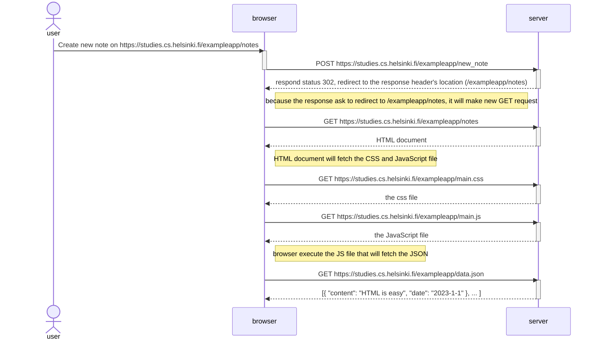

```mermaid
sequenceDiagram
    actor user
    participant browser
    participant server

    user->>browser: Create new note on https://studies.cs.helsinki.fi/exampleapp/notes
    activate browser
    browser->>server: POST https://studies.cs.helsinki.fi/exampleapp/new_note
    deactivate browser
    activate server
    server-->>browser: respond status 302, redirect to the response header's location (/exampleapp/notes)
    deactivate server

    note right of browser: because the response ask to redirect to /exampleapp/notes, it will make new GET request 

    browser->>server: GET https://studies.cs.helsinki.fi/exampleapp/notes
    activate server
    server-->>browser: HTML document
    deactivate server

    note right of browser: HTML document will fetch the CSS and JavaScript file

    browser->>server: GET https://studies.cs.helsinki.fi/exampleapp/main.css
    activate server
    server-->>browser: the css file
    deactivate server

    browser->>server: GET https://studies.cs.helsinki.fi/exampleapp/main.js
    activate server
    server-->>browser: the JavaScript file
    deactivate server

    Note right of browser: browser execute the JS file that will fetch the JSON

    browser->>server: GET https://studies.cs.helsinki.fi/exampleapp/data.json
    activate server
    server-->>browser: [{ "content": "HTML is easy", "date": "2023-1-1" }, ... ]
    deactivate server
```