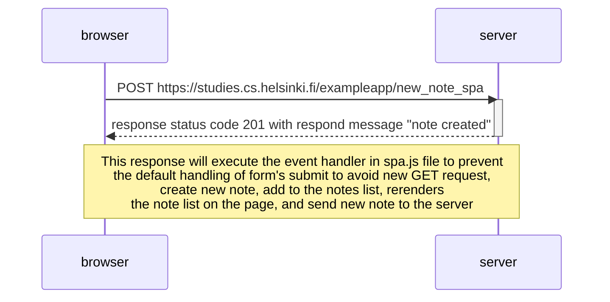

```mermaid
sequenceDiagram
    participant browser
    participant server

    browser->>server: POST https://studies.cs.helsinki.fi/exampleapp/new_note_spa
    activate server
    server-->>browser: response status code 201 with respond message "note created"
    deactivate server

    note over browser,server: This response will execute the event handler in spa.js file to prevent  <br/> the default handling of form's submit to avoid new GET request,<br/>  create new note, add to the notes list, rerenders <br/> the note list on the page, and send new note to the server
```